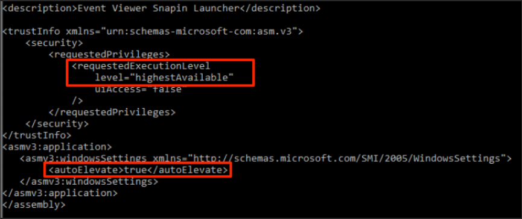
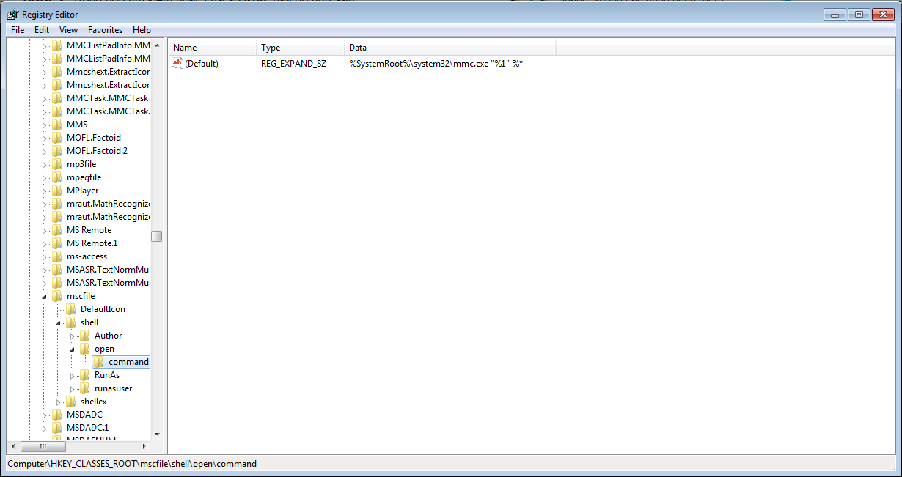
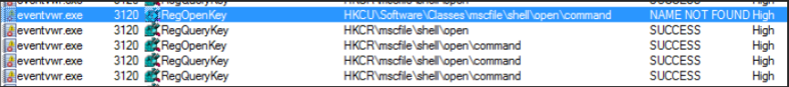
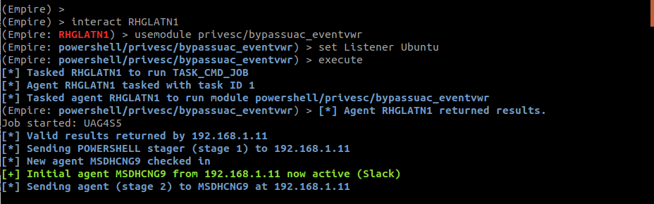
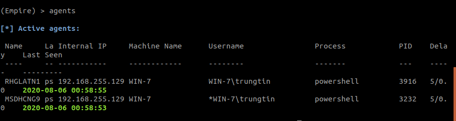
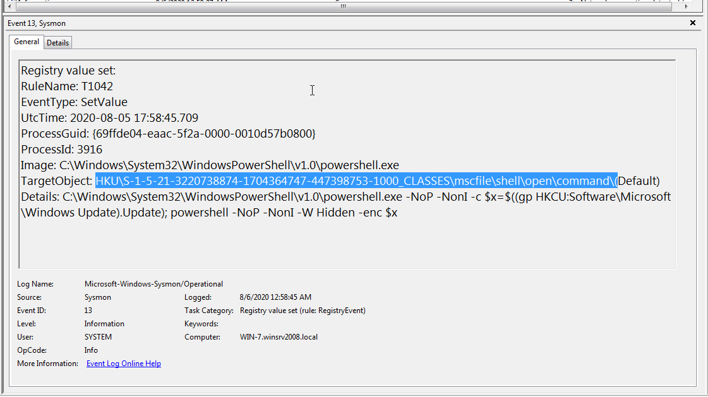
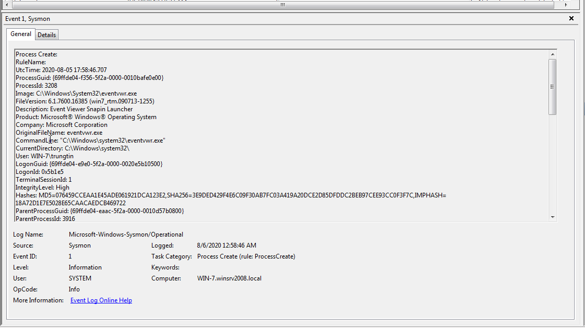
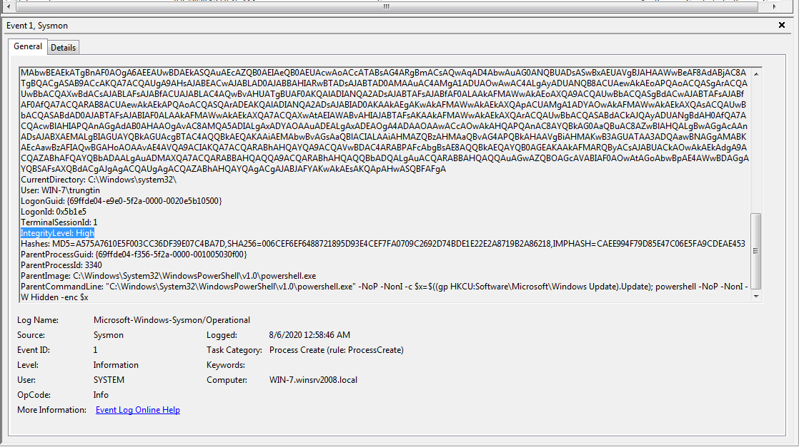
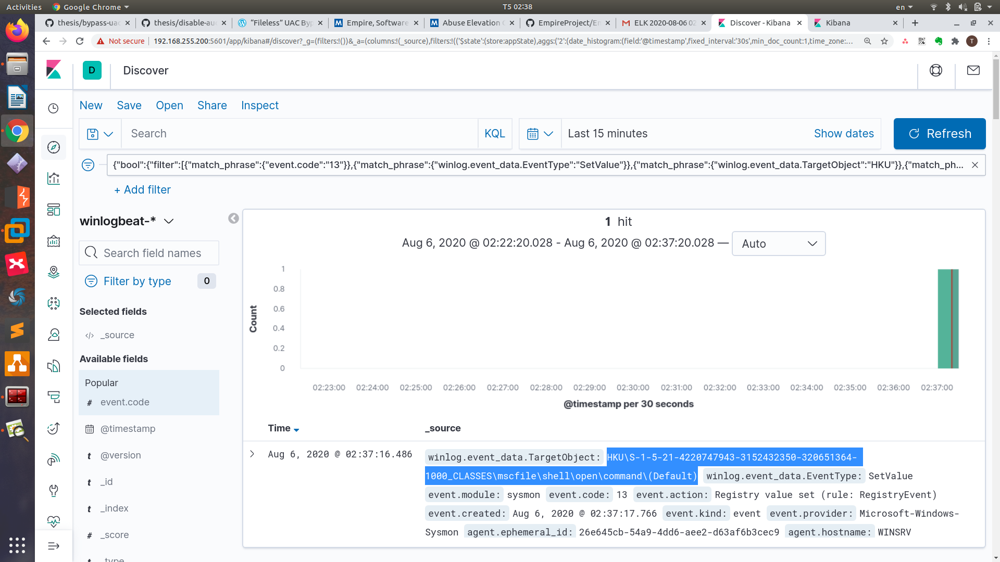
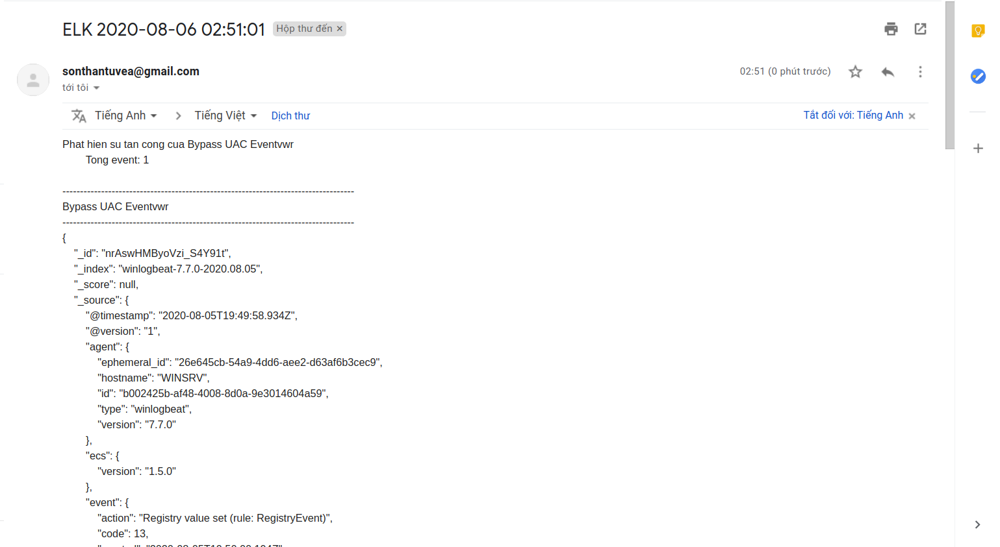

# Bypass UAC bằng cách sử dụng eventvwr.exe
* Ngày: 05/08/2020
* Loại tấn công: 

## I. Tổng quan
### 1. Hive, key, value trong Registry
* Registry hive trong Windows Registry là tên được đặt cho một phần chính của registry có chứa registry key, registry subkey (khoá con registry) và registry value (giá trị registry).
* Tất cả các key được coi là hive bắt đầu bằng "HKEY" và nằm ở thư mục root hoặc trên cùng của hệ thống phân cấp trong registry, đó là lý do tại sao đôi khi chúng còn được gọi là key gốc hoặc các hive hệ thống cốt lõi. [4]
* Dưới đây là danh sách các registry hive phổ biến trong Windows:
  * HKEY_CLASSES_ROOT (HKCR)
  * HKEY_CURRENT_USER (HKCU)
  * HKEY_LOCAL_MACHINE
  * HKEY_USERS
  * HKEY_CURRENT_CONFIG
### 2. Bypass UAC
* User Account Control (UAC) là 1 tính năng của Windows giúp ngăn chặn các sự thay đổi đến hệ thống mà không được cho phép.
* Bypass UAC là các kỹ thuật nhằm mục đích thực thi hoặc thực hiện các thay đổi với đặc quyền hệ thống mà không có bất kỳ cảnh báo nào.
* Chỉ có thể tiến hành bypass UAC đối với các tài khoản thuộc administrator group và kích hoạt UAC (enable UAC)
### 3. Powershell Empire
* Là một công cụ thực thi hoàn toàn trên powershell và công dụng phần nhiều nằm ở các tính năng mà nó có thể khai thác ở máy nạn nhân sau xảy ra tấn công (post-exploitation), được xây dựng trên các giao tiếp bảo mật bằng mật mã và kiến trúc linh hoạt
* Đây là một công cụ mã nguồn mở, được sự đóng góp của nhiều người
* Sau khi thực hiện exploit thành công, các module có thể được triển khai một cách nhanh chóng, từ việc có thể sử dụng keylogger cho đến mimikatz và tất cả được gói gọn trong một framework.
* Powershell Empire hỗ trợ nhiều module để có thể thực hiện các tấn công Bypass UAC.
* bypassuac_eventvwr là một module của Powershell Empire. Nguyên lý hoạt động dựa trên việc khai thác lúc khởi chạy chương trình eventvwr.exe. 
Khi mở eventvwr.exe, tiến trình này sẽ kiểm tra giá trị registry HKCU\Software\Classes\mscfile\shell\open\command để tìm vị trí của chương trình mmc.exe, tiến trình được sử dụng để mở eventvwr.msc saved console file.
Nếu đường dẫn tới mmc.exe bị thay bởi một chương trình hoặc một đoạn script khác (thay đổi giá trị của registry HKCU\Software\Classes\mscfile\shell\open\command), nó sẽ được thực thi với quyền hệ thống mà không bị thông báo nhắc nhở cần nâng cao đặc quyền UAC hiển thị tại giao diện người dùng. [2]

## II. Thực hiện tấn công
### 1. Cách hoạt động của Bypass UAC bằng cách khai thác lỗ hỏng của eventvwr.exe
* HKCR hive bao gồm sự kết hợp của HKLM:\Software\Classes and HKCU:\Software\Classes. Bởi vì sự sáp nhập bởi những hive này nên ta có thể hijack giá trị cho HKCR:\ bằng cách tạo chúng tại HKCU:\Software\Classes.
* Một user thường có quyền ghi vào key tại HKCU. Nếu một tiến trình với đặc quyền hệ thống tương tác với key mà ta thao tác, ta có khả năng can thiệp vào các hành động của các tiến trình hệ thống đang thực hiện.
* eventvwr.exe là một chương trình tự động nâng cao đặc quyền (auto-elevates) bởi vì file manifest của chương trình này thể hiện:

* Sử dụng Procmon, ta thấy tiến trình **eventvwr.exe** tương tác với `HKCU\Software\Classes\mscfile\shell\open\command` với kết quả trả về `NAME NOT FOUND`.
Sau đó **eventvwr.exe** tương tác với `HKCR\mscfile\shell\open\command`. Quan sát `HKCR\mscfile\shell\open\command`, ta có thể thấy giá trị mặc định gọi đến là **mmc.exe** (Microsoft Management Console), tiến trình chịu trách nhiệm cho việc load Management Snap-Ins:

* Quan sát thấy **eventvwr.exe** gửi truy vấn tới `HKCU\Software\Classes\mscfile\shell\open\command` trước `HKCR\mscfile\shell\open\command` và kết quả trả về của `HKCU\Software\Classes\mscfile\shell\open\command` là `NAME NOT FOUND` nên mới gọi đến giá trị tại đường dẫn của HKCR (mmc.exe).

* Từ kết quả trên, ta có thể thấy được **eventvwr.exe** - tiến trình với đặc quyền hệ thống, đã tiến hành truy vấn cả HKCU và HKCR để có thể khởi động mmc.exe. Sau khi mmc.exe được khởi động, nó sẽ mở **eventvwr.msc** (Microsoft Saved Console file) - một file cần thiết để Event Viewer có thể hiển thị được.
* Bởi vì đường dẫn của HKCU được truy vấn trước HKCR (mặc định sẽ có giá trị là mmc.exe) và người dùng có quyền ghi vào HKCU, nên nếu thêm giá trị HKCU bởi một đường dẫn tới file thực thi mà ta mong muốn (chẳng hạn cmd hoặc powershell),thì cmd hoặc powershell này sẽ được eventvwr.exe mở và có thể thực thi lệnh với quyền hệ thống.
* *Vậy attacker có thể khai thác lỗ hỏng của **eventvwr.exe** bằng cách thay đổi giá trị của registry* `HKCU\Software\Classes\mscfile\shell\open\command`
### 2. Sử dụng module bypassuac_eventvwr
* Khi một victim bị mắc phải powershell empire, ta có thể sử dụng module bypassuac_eventvwr để nâng lên tài khoản hệ thống (NT Authority/System):
```
usemodule privesc/bypassuac_eventvwr
set Listener [Tên của Listener]
execute
```

* Kết quả: Tài khoản đã được nâng cao đặc quyền

### 3. Phát hiện thủ công
* Event ID 13 tại Sysmon Log: (Registry value set): Thay đổi giá trị của registry key `HKCU\Software\Classes\mscfile\shell\open\command`

* Event ID 1 tại Sysmon Log: (Process Create): Sự mở eventvwr với đặc quyền hệ thống

* Event ID 1 tại Sysmon Log: (Process Create): eventvwr.exe thực thi một đoạn powershell script với quyền hệ thống

### 4. Bằng chứng sự thực thi
* Event ID 13: (Registry value set): Với giá trị của trường **Target Object** thỏa điều kiện sau:
  * Target Object: HKU\*\mscfile\shell\open\command\(Default)

## III. Chuyển sang query DSL
* Từ bằng chứng thực thi của Bypass UAC khai thác vào **eventvwr.exe**, ta có câu lệnh query DSL tương ứng như sau:
  * `event.code: 13`
  * `winlog.event_data.EventType: SetValue`
  * `winlog.event_data.TargetObject: HKU\*\mscfile\shell\open\command\(Default)`
```
{
  "version": true,
  "size": 500,
  "sort": [
    {
      "@timestamp": {
        "order": "asc",
        "unmapped_type": "boolean"
      }
    }
  ],
  "aggs": {
    "2": {
      "date_histogram": {
        "field": "@timestamp",
        "fixed_interval": "30s",
        "time_zone": "Asia/Ho_Chi_Minh",
        "min_doc_count": 1
      }
    }
  },
  "query": {
    "bool": {
      "filter": [
        {
          "match_phrase": {
            "event.code": "13"
          }
        },
        {
          "match_phrase": {
            "winlog.event_data.EventType": "SetValue"
          }
        },
        {
          "match_phrase": {
            "winlog.event_data.TargetObject": "HKU"
          }
        },
        {
          "match_phrase": {
            "winlog.event_data.TargetObject": "\\mscfile\\shell\\open\\command\\(Default)"
          }
        }
      ]
    }
  }
}
```
* Cảnh báo tại kibana:

* Cảnh báo tại mail của quản trị viên:


## IV. Kết quả thực nghiệm
| Username | Địa chỉ IP | Hệ điều hành | Vai trò của tài khoản | Số lần thực hiện | Số lần thành công |
|:-------:|:------:|:------:|:------:|:------:|:------:|
| sv | 192.168.255.100 | Windows Server 2008 | Thành viên của Administrator group | 4 | 4 |
* Số lần thực hiện: 4
* Tỉ lệ thành công: 100%
* Video demo: [Bypass UAC using eventvwr.exe](https://youtu.be/k2lO-1VQHKc)

## V. Tài liệu tham khảo
* [[1] "Empire"](https://attack.mitre.org/software/S0363/)
* [[2] Matt Nelson, Matt Graeber, "UAC bypass"](https://lolbas-project.github.io/lolbas/Binaries/Eventvwr/)
* [[3] enigma0x3, "FILELESS UAC BYPASS USING EVENTVWR.EXE AND REGISTRY HIJACKING"](https://enigma0x3.net/2016/08/15/fileless-uac-bypass-using-eventvwr-exe-and-registry-hijacking/)
* [[4] "Registry Hive là gì?"](https://quantrimang.com/registry-hive-la-gi-165892#:~:text=Registry%20hive%20l%C3%A0%20m%E1%BB%99t%20th%C6%B0,v%C3%A0%20registry%20key%20c%C5%A9ng%20v%E1%BA%ADy.&text=S%E1%BB%B1%20kh%C3%A1c%20bi%E1%BB%87t%20duy%20nh%E1%BA%A5t,v%C3%A0%20nh%E1%BB%AFng%20registry%20key%20kh%C3%A1c.)
