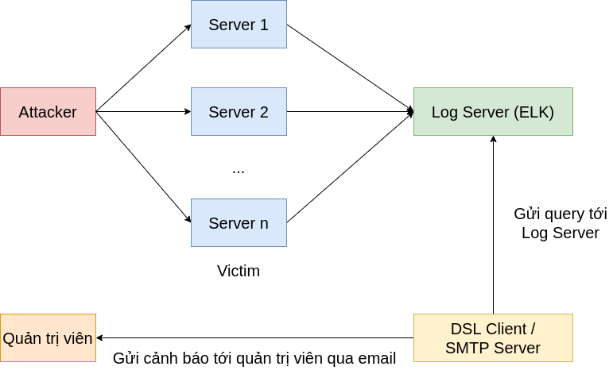

# Thesis: Xây dựng hệ thống phát hiện các tấn công máy tính dựa trên ELK stack.
Author: Phạm Trung Tín - Trần Vĩ Hùng. 
Date: 07/08/2020. 
Description: Capturing the Windows's threats using ELK Stack and Python Script.

## Luận văn sẽ khảo sát 22 threats sau:
* Test case 1 PsExec
* Test case 2 Powershell Empire
* Test case 3 Invoke-Command cmdlet
* Test case 4 WinRS
* Test case 5 WMIC
* Test case 6 vmiexec.vbs
* Test case 7 PWDump7
* Test case 8 Quarks PwDump
* Test case 9 WCE - Password and Hash Dump
* Test case 10 WCE Remote Login
* Test case 11 Golden Ticket
* Test case 12 AT Command
* Test case 13 RDP
* Test case 14 Mimikatz
* Test case 15 Bypass UAC
* Test case 16 ntdsutil
* Test case 17 vssadmin
* Test case 18 net user
* Test case 19 csvde
* Test case 20 ldifde
* Test case 21 Timestomp
* Test case 22 wevtutil

## Mô tả hệ thống
Các máy trong hệ thống bao gồm: Máy attacker, các máy Windows Server,
log server và máy monitor. Máy attacker sẽ tấn công vào các máy sử dụng hệ điều
hành Windows Server. Ở đây các máy Windows Server đóng vai trò là victim. Toàn
bộ log từ các máy victim này sẽ được đẩy về log server - nơi lưu trữ log tập trung.
Log server sử dụng bộ công cụ ELK để đánh chỉ mục sau đó đưa vào lưu trữ và
quản lý lượng log từ các máy Windows Server gửi về. Máy monitor được dùng để
truy vấn dữ liệu từ log server (Sử dụng Query DSL), nếu có phát hiện ra các nguy cơ thì sử dụng giao thức
SMTP để gửi cảnh báo về email cho quản trị viên.

